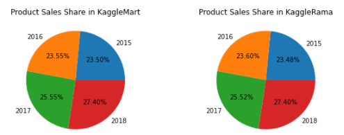
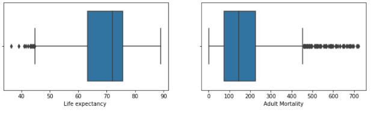
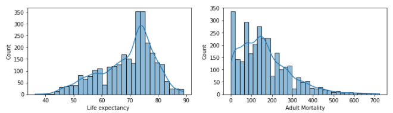

# Apanpa-Kolade
Data science projects portfolio
# [Project 1: Playground on Kaggel](https://github.com/abolayo/DScience/blob/master/kaggel/tabular-playground-series-jan2022.ipynb)
* Exploratory Data Analysis: thorough examination to uncover the underlying structure of the given data set.
* Data Preprocessing
* Visualization
* Modelling 

# [Project 2: Data Science Life Expentancy Estimator](https://github.com/abolayo/DScience/blob/master/life-expectancy/life_expectancy_demo.ipynb)
* Data Wrangling
* Build Data Profile and plots
* Explore Data Relationships
* Identification and creation of features (Feature Engineering)
* Create Dummy or Indicator features for Categorical variables
* Standardize the magnitude of numeric features
* Modelling and Review of used models

 
 
# [Project 3: Data Science Impact of covid19 on the global Economy](https://github.com/HDSC-21/covid19-on-the-global-economy/blob/main/Image/EDA.ipynb)
For this project I EDA
* Data vitualization
* Modelling

 
