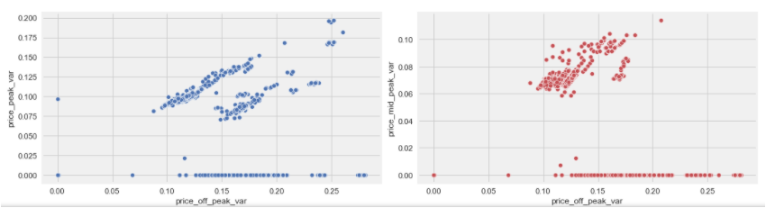
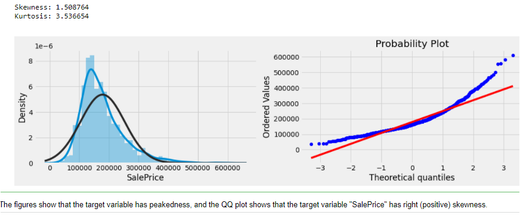
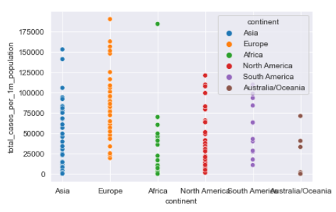

# Apanpa-Kolade
## Data science projects portfolio

# [Project from Forage:BCG Data Science & Advanced Analytics Virtual Experience Program ](https://github.com/abolayo/DScience/blob/master/forage/forage.ipynb)
 * Business Understanding & Hypothesis Framing: Understanding the business context and problem statement.
 * Exploratory data analysis: Understanding the business through data
 * Data Visualization and Feature Engineering 
 * Modelling : Uncovering signals within the data, predicting churn probability and evaluating model performance.
 * Findings and Recommendations
 
 
 
# [Project from Playground on Kaggel](https://github.com/abolayo/DScience/blob/master/kaggel/tabular-playground-series-jan2022.ipynb)
* Exploratory Data Analysis: thorough examination to uncover the underlying structure of the given data set.
* Data Preprocessing
* Visualization
* Modelling 

# [Project on Life Expentancy Estimator](https://github.com/abolayo/DScience/blob/master/life-expectancy/life_expectancy_demo.ipynb)
* Data Wrangling
* Build Data Profile and plots
* Explore Data Relationships
* Identification and creation of features (Feature Engineering)
* Create Dummy or Indicator features for Categorical variables
* Standardize the magnitude of numeric features
* Modelling and Review of used models

 
 
 # [Project on Predicting House Prices - Advanced Regression Techniques](https://github.com/abolayo/DScience/blob/master/kaggel/house-prices.ipynb)
 * Data Preprocessing
 * Data Visualiztion
 * Modelling
 * Analysis and Summary
 
 
  
# [Project on Impact of Covid19 on Global Economy](https://github.com/HDSC-21/covid19-on-the-global-economy/blob/main/Image/EDA.ipynb)
* Data Vitualization
* Modelling

 
 
 

 
